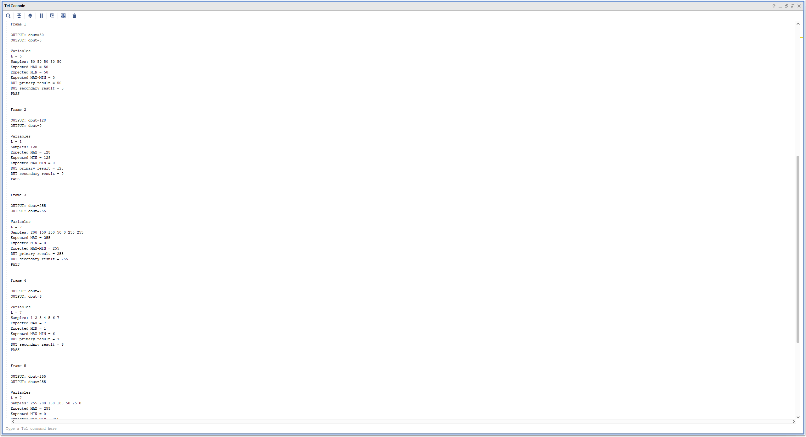
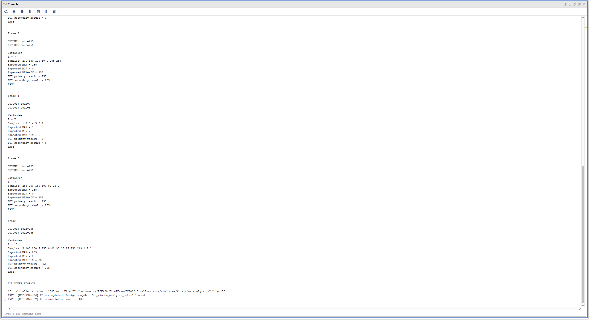

# FPGA Window Analyzer

A synthesizable **SystemVerilog** module that collects a variable-length window of 8-bit data samples and computes two statistical outputs: the **maximum value** and the **range** (max − min). Designed and verified for the **Basys3 FPGA** using Vivado.

---

## Overview

This project implements a finite state machine (FSM)-based digital signal processing module. Given a stream of incoming data samples, the module:

1. Collects up to 16 samples into an internal memory
2. Computes the **primary output**: maximum value across the window
3. Computes the **secondary output**: range (max − min) across the window
4. Outputs results sequentially with valid handshaking signals

This design reflects real-world RTL engineering practices including FSM-based control, registered I/O, handshaking signals, and on-chip memory.

---

## Module Interface

| Port | Direction | Width | Description |
|------|-----------|-------|-------------|
| `clk` | input | 1 | System clock |
| `rst` | input | 1 | Synchronous reset |
| `start` | input | 1 | Initiates a new window capture |
| `din_valid` | input | 1 | Indicates valid input data |
| `din` | input | 8 | Input data sample (window length encoded in first sample) |
| `dout` | output | 8 | Output result |
| `dout_valid` | output | 1 | Indicates valid output data |
| `busy` | output | 1 | High while module is processing |
| `done` | output | 1 | Pulses high when processing is complete |

> **Note:** The window length (1–16 samples) is encoded in the lower 4 bits of the first `din` sample when `start` and `din_valid` are both asserted.

---

## FSM Architecture

The module is controlled by a 6-state FSM. Combinational next-state logic is separated from registered output logic, following clean RTL design practice.

```
        start & din_valid
IDLE ─────────────────────► COLLECT
                                │
                    wr_idx == length_reg
                                │
                                ▼
                        COMPUTE_PRIMARY
                                │
                    rd_idx == length_reg
                                │
                                ▼
                       COMPUTE_SECONDARY
                                │
                    rd_idx == length_reg
                                │
                                ▼
                        OUTPUT_PRIMARY
                                │
                                ▼
                       OUTPUT_SECONDARY ──► IDLE
```

### State Descriptions

| State | Description |
|-------|-------------|
| `IDLE` | Waits for `start` and `din_valid`. Latches window length from `din[3:0]`. |
| `COLLECT` | Stores incoming samples into `sample_mem[]` until `wr_idx == length_reg`. |
| `COMPUTE_PRIMARY` | Iterates through memory to find the maximum value. |
| `COMPUTE_SECONDARY` | Iterates through memory to find the minimum value. |
| `OUTPUT_PRIMARY` | Drives `dout` with `max_reg`, asserts `dout_valid`. |
| `OUTPUT_SECONDARY` | Drives `dout` with `max_reg - min_reg`, asserts `dout_valid` and `done`, deasserts `busy`. |

---

## Design Decisions

### Separated Sequential and Combinational Logic
Next-state logic is implemented in a separate `always_comb` block from the registered datapath. This avoids latches, improves synthesis results, and follows industry-standard RTL coding style.

### Two-Pass Computation
Maximum and minimum are computed in separate FSM states (`COMPUTE_PRIMARY` and `COMPUTE_SECONDARY`) rather than a single pass. This was a deliberate trade-off: it increases latency by one traversal of memory, but simplifies the control logic and avoids combinational complexity in a single state.

### On-Chip Memory Array
Samples are stored in a 16-entry 8-bit memory array (`sample_mem[0:15]`). This maps to block RAM or distributed RAM on the Basys3, avoiding the need for external memory while keeping the design fully synthesizable.

### Handshaking Signals
The `busy`, `done`, and `dout_valid` signals provide a clean handshaking interface. This mirrors real-world AXI-style streaming conventions and makes the module straightforward to integrate into a larger system.

---

## Simulation Results

The testbench (`tb_window_analyzer.v`) verifies correct FSM transitions, output values, and handshaking behavior across multiple test cases.


**TCL Console — Test Run 1:**


**TCL Console — Test Run 2:**


---

## Synthesis Reports

### Timing
See [`docs/timing_report.txt`](docs/timing_report.txt) for the full Vivado timing report.

### Utilization
See [`docs/utilization_report.txt`](docs/utilization_report.txt) for resource utilization on the Basys3 (Artix-7).

---

## Repository Structure

```
FPGA-Window_Analyzer/
├── README.md
├── src/
│   ├── window_analyzer.sv       # Top-level RTL module
│   └── tb_window_analyzer.v     # Testbench
└── docs/
    ├── Simulation Results - annotated.png
    ├── tclscreenshot1.png
    ├── tclscreenshot2.png
    ├── timing_report.txt
    └── utilization_report.txt
```

---

## Tools Used

- **Language:** SystemVerilog (IEEE 1800)
- **Simulator / Synthesizer:** Xilinx Vivado
- **Target Hardware:** Digilent Basys3 (Xilinx Artix-7 FPGA)

---

## Author

**Christian Watts**
B.S. Electrical Engineering, The University of Alabama
